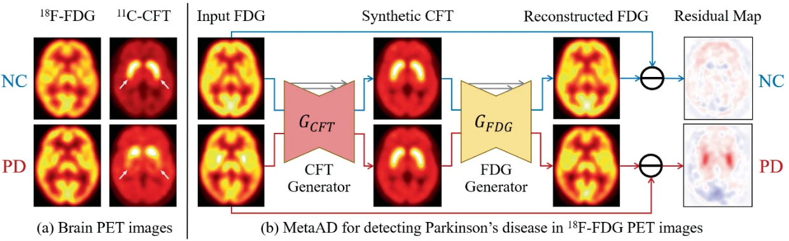
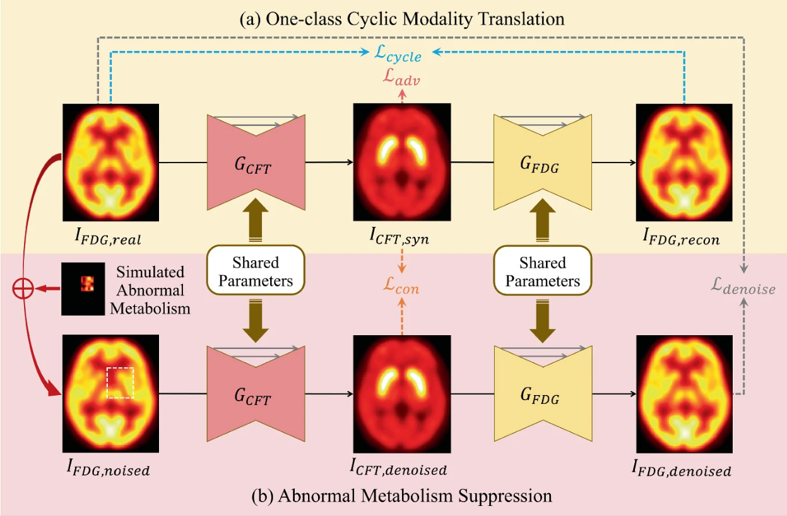

<h1 align="center">MetaAD</h1>

<div align="center">


[](https://github.com/MedAIerHHL/MetaAD/stargazers)

</div>

<p align="center"></p>

## News

- We have released our preliminary code. We are currently reorganizing the entire framework. If you encounter any issues, please contact us at 1729766533@qq.com. (preliminary code reference: https://github.com/ZhenrongShen/FDG-to-CFT_PET_Synthesis)
- We received the MICCAI 2024 Young Scientist Award. You can find more details [here](https://miccai.org/index.php/about-miccai/awards/best-paper-award-and-young-scientist-award/).
- Our paper was selected as a Best Paper Candidate.
- We were invited to give an oral presentation.
- Our paper was early accepted, ranking in the top 11%.

## Paper

(*Equal contribution, #Corresponding authors)

This repository provides the official implementation in the following paper:

**MetaAD: Metabolism-Aware Anomaly Detection for Parkinson's Disease in 3D [18F]FDG PET**

Haolin Huang*, [Zhenrong Shen](https://zhenrongshen.github.io/)*, Jing Wang\*, Xinyu Wang, Jiaying Lu, Huamei Lin, Jingjie Ge, Chuantao Zuo#, [Qian Wang](https://qianwang.space/)#

<p align="center"></p>

## Citation

If you use this code or use our pre-trained weights for your research, please cite our papers:

```
@inproceedings{huang2024metaad,
  author = {Huang, Haolin and Shen, Zhenrong and Wang, Jing and Wang, Xinyu and Lu, Jiaying and Lin, Huamei and Ge, Jingjie and Zuo, Chuantao and Wang, Qian and others},
  title = {MetaAD: Metabolism-Aware Anomaly Detection for~Parkinson's Disease in \$\${\textbackslash}text {3D}\$\$ \$\${\textasciicircum}{\textbackslash}text {18}\$\$F-FDG PET},
  pages = {291--301},
  year = {2024},
  booktitle = {Medical Image Computing and Computer Assisted Intervention -- MICCAI 2024},
  series = {Lecture Notes in Computer Science},
  publisher = {Springer Nature Switzerland},
  address = {Cham},
  isbn = {978-3-031-72069-7}
}
```
